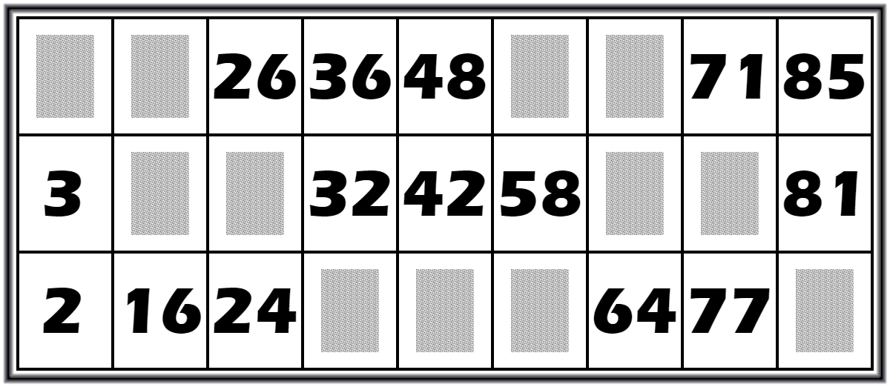

    <h1>
        <a href="https://lotto-grid-maker.netlify.app/">
            Lotto Grid Maker
        </a>
    </h1>

This website allows you to generate printable lotto grids. You can choose the number of grid per page and the number of pages.

## Usage

You can use the website [here](https://lotto-grid-maker.netlify.app/).

- You can click on the flag to switch the language between English and French
- Choose the amount of grids you want to generate
- Choose the file format (PDF or PNG). If you choose PNG, all the grids will be stored in a ZIP file
- If you choose PDF, choose the number of grids per page (3 is good for A4 paper)
- If you choose PDF, choose the compression level (usually fast is enough)
- Click on "Generate" and wait for the download to start

## Grids generation

The grids are generated based on these constraints:

- There are 45 numbers per grid
- Each number is unique
- Each row contains 5 numbers
- Each column contains 1 or 2 numbers
- For each number in a column: $`10 \times \text{column\_number} \leq \text{number} \leq 10 \times \text{column\_number} + 9`$

There is no check to prevent the generation of 2 identical grids but it would be useless as the odds of it happening are stupidly low ($` \approx 1 \times 10^{-18} `$)

## Libraries

- [Tailwind CSS](https://tailwindcss.com/)
- [Font Awesome](https://fontawesome.com/)
- [Flag Icons](https://flagicons.lipis.dev/)
- [jsPDF](https://artskydj.github.io/jsPDF/)
- [JSZip](https://stuk.github.io/jszip/)

## License

This project is under the MIT license. See the [LICENSE](LICENSE) file for more details.
